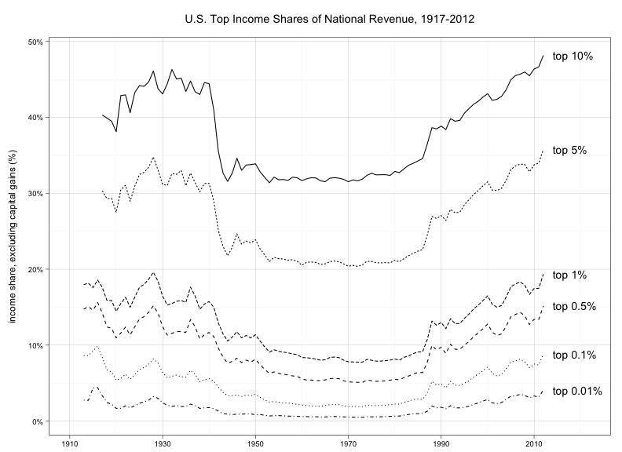
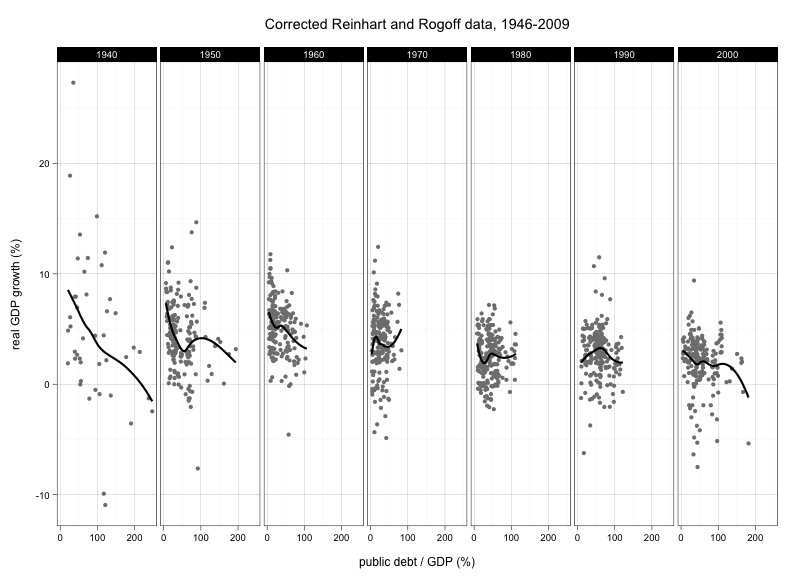

A collection of data analysis examples written in R, used in [this course][aad]. Some code and data borrowed from [Larry Bartels](http://themonkeycage.org/2013/01/08/obama-toes-the-line/), [Anthony Damico](http://www.asdfree.com/), [Douglas Hibbs](http://douglas-hibbs.com/), [Thomas Piketty](http://piketty.pse.ens.fr/fr/) and [Emmanuel Saez](http://eml.berkeley.edu/~saez/), [Cosma Shalizi](http://www.stat.cmu.edu/~cshalizi/), and [Boris Shor](http://research.bshor.com/).

[aad]: http://goo.gl/foVUYr

Example graphs:

